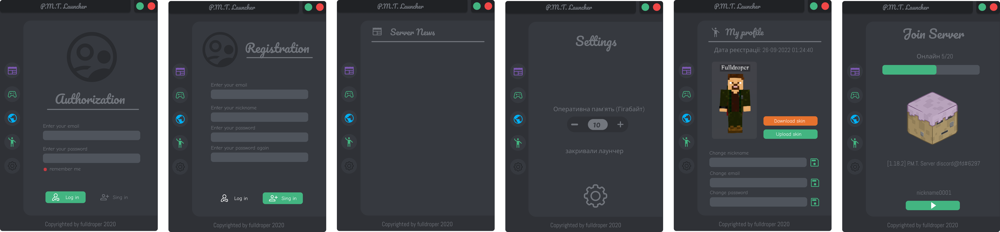

The purpose of this project is to create a launcher for a personal Minecraft server, featuring mods, user authentication, a news feed, an interactive world map, and a user dashboard. The design is custom-made.

### Project Benefits
This project enhances the user experience by integrating essential server functionalities into a single launcher, making it easier for players to manage and access server features.

### How the Project Works
The project utilizes Node.js and Electron.js to create a desktop application that provides seamless access to server features, including mod management, user authentication, server news, and an interactive map.

### An UX/UI design of launcher


### Repository and Installation
[GitHub Repository](https://github.com/Fulldroper/mine-launcher)

To install and run the project:

1. Clone the repository:
    ```bash
    git clone https://github.com/Fulldroper/mine-launcher
    cd mine-launcher
    ```

2. Install dependencies and start the launcher:
    ```bash
    npm install
    npm start
    ```

### Project Workflow
1. **Setup Project:** Initialize the project structure and dependencies.
    ```bash
    npm init
    npm install
    ```

2. **Develop Main Interface:** Create the main window and interface for the launcher.
    ```javascript
    const { app, BrowserWindow } = require('electron');

    function createWindow () {
        const win = new BrowserWindow({
            width: 800,
            height: 600,
            webPreferences: {
                preload: path.join(__dirname, 'preload.js')
            }
        });

        win.loadFile('index.html');
    }

    app.whenReady().then(() => {
        createWindow();
        app.on('activate', () => {
            if (BrowserWindow.getAllWindows().length === 0) createWindow();
        });
    });

    app.on('window-all-closed', () => {
        if (process.platform !== 'darwin') app.quit();
    });
    ```

3. **Integrate Features:** Implement the news feed, interactive map, and user dashboard.
    ```html
    <!DOCTYPE html>
    <html>
    <head>
        <title>Minecraft Launcher</title>
    </head>
    <body>
        <h1>Minecraft Launcher</h1>
        <div id="news-feed"></div>
        <div id="map"></div>
        <div id="dashboard"></div>
    </body>
    </html>
    ```

### Skills Gained
- Developing desktop applications using Electron.js
- Integrating game server features into a single interface
- Managing user authentication and server interaction
